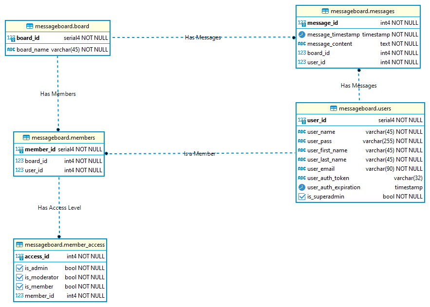

# Project Zero - Message Board

## Summary
- Project 0 for Revature Training 220627
- Built with Gradle, Javalin, and JDBC
- No frontend. Just API / HTTP Requests.
- Response data format is JSON
- Users can create their boards and post messages
- Has access levels

## Postgres ERD

## License

MIT